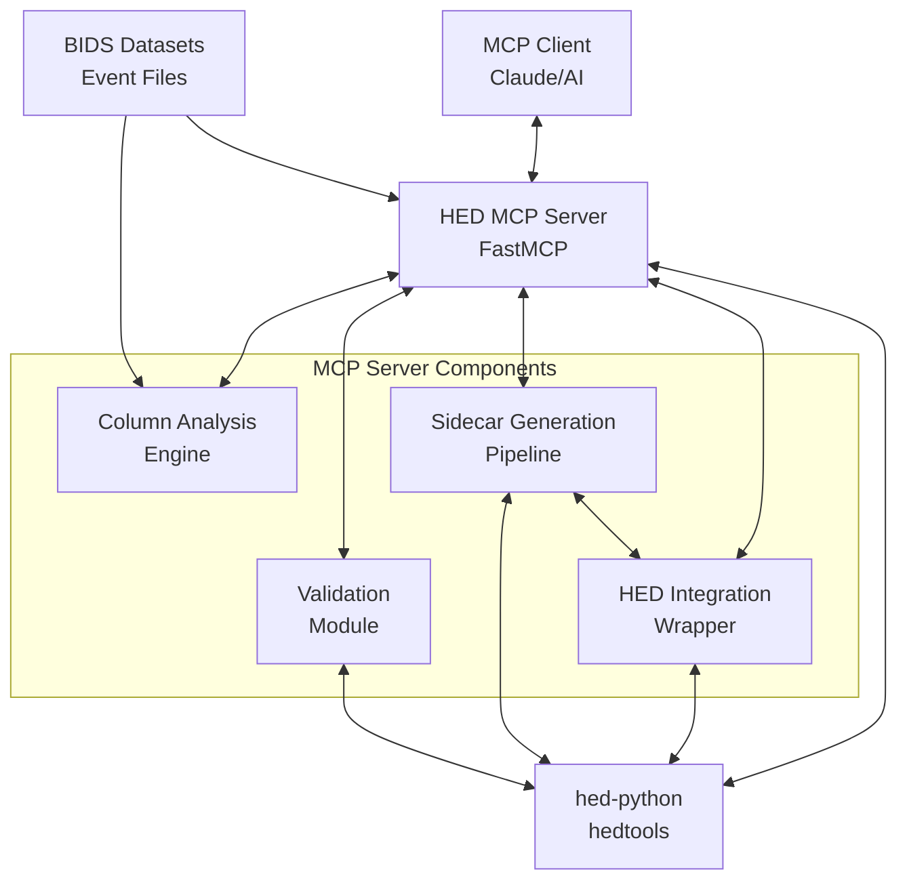

# HED MCP Server

> [!CAUTION]
> **Implementation Status**: This project is currently in active development. The implementation is coming soon!

A Model Context Protocol (MCP) server that assists with HED (Hierarchical Event Descriptors) sidecar creation and annotation. The server leverages LLMs to automate the typically manual process of categorizing BIDS event file columns and generate valid HED sidecar templates using hed-python tools.

## Overview

The HED MCP Server bridges the gap between BIDS (Brain Imaging Data Structure) datasets and HED annotation by providing AI-powered column classification and automated sidecar generation. This tool is designed to streamline the workflow for researchers working with neuroimaging data who need to create HED-compliant annotations.

### Key Features

- **AI-Powered Column Classification**: Automatically categorize BIDS event file columns using LLM intelligence
- **Automated Sidecar Generation**: Generate valid HED sidecar templates using TabularSummary from hed-python
- **MCP Integration**: Seamless integration with AI applications through the Model Context Protocol
- **Performance Optimized**: <2 seconds for analysis, <10 seconds for sidecar generation
- **Scientific Standards**: Full compliance with BIDS and HED specifications
- **Multiple Integration Options**: Support for both direct API and web service approaches

## Architecture



### Core Components

1. **Column Analysis Engine**: Extracts and analyzes BIDS event file columns for LLM classification
2. **HED Integration Wrapper**: Interfaces with hedtools TabularSummary and schema validation
3. **Sidecar Generation Pipeline**: Orchestrates column classification → sidecar generation workflow
4. **MCP Server Framework**: FastMCP-based server with stdio transport
5. **Validation Module**: Ensures generated sidecars meet HED standards

## Planned Features

### MCP Tools
- `analyze_event_columns`: Extract column information and unique values from BIDS event files
- `generate_hed_sidecar`: Generate HED sidecar templates using TabularSummary

### MCP Resources
- `hed_schemas`: List available HED schemas and versions (up to 8.2.0)

### Workflow Integration
Based on the proven `extract_json_template.ipynb` workflow:
1. Load BIDS event files
2. Classify columns (skip vs value columns)
3. Use TabularSummary to generate sidecar templates
4. Validate generated HED annotations

## Technical Specifications

### Dependencies
- **hedtools** ≥0.5.0 - Official HED Python tools
- **mcp** ≥1.9.0 - Model Context Protocol framework
- **pandas** ≥2.0.0 - Data manipulation
- **numpy** ≥1.24.0 - Numerical operations

### Performance Requirements
- Column analysis: < 2 seconds response time
- Sidecar generation: < 10 seconds response time
- Concurrent request handling with robust error management
- Memory-efficient processing for large datasets

### Compatibility
- Python 3.10+
- Latest hedtools and MCP versions
- Cross-platform support (Windows, macOS, Linux)
- No local path dependencies - fully distributable

## Development Setup

### Prerequisites

- Python 3.10 or higher
- [uv](https://docs.astral.sh/uv/) for dependency management

### Installation & Setup

#### Using uv (Recommended)

First, install uv if you haven't already:

```bash
# On macOS and Linux
curl -LsSf https://astral.sh/uv/install.sh | sh

# On Windows
powershell -c "irm https://astral.sh/uv/install.ps1 | iex"

# Or via pip
pip install uv
```

#### Development Setup

```bash
# Clone the repository
git clone https://github.com/neuromechanist/hed-mcp.git
cd hed-mcp

# Set up development environment with uv
uv sync --dev
```

This command will:
- Create a virtual environment in `.venv/`
- Install all project and development dependencies
- Generate `uv.lock` for reproducible builds
- Install the package in editable mode

#### Activate the environment

```bash
source .venv/bin/activate
```

Or use uv directly without activation:
```bash
uv run python script.py
uv run pytest
```

### Project Structure

```
hed-mcp/
├── src/hed_tools/     # Main package
│   ├── server/                   # MCP server components
│   ├── tools/                    # Analysis tools & MCP tools
│   ├── hed_integration/         # HED-specific functionality
│   └── utils/                   # General utilities
├── tests/                       # Test suite
│   ├── unit/                    # Unit tests
│   └── integration/             # Integration tests
├── docs/                        # Documentation
│   ├── api/                     # API documentation
│   ├── user_guide/             # User guides
│   └── examples/               # Usage examples
├── pyproject.toml              # Project configuration
├── uv.lock                     # Dependency lock file
└── README.md                   # This file
```

### Common Development Commands

```bash
# Run tests
uv run pytest

# Run with coverage
uv run pytest --cov=src/hed_tools

# Code formatting
uv run black src/ tests/
uv run isort src/ tests/

# Type checking
uv run mypy src/

# Linting
uv run ruff check src/ tests/

# Add new dependency
uv add package-name

# Add development dependency
uv add --dev package-name

# Update dependencies
uv sync --upgrade

# Run the server
uv run hed-mcp-server

# Or run as a Python module
uv run python -m hed_tools.server
```

## Installation

### Development Installation

If you want to install from source for development:

```bash
# Clone the repository
git clone https://github.com/neuromechanist/hed-mcp.git
cd hed-mcp

# Set up development environment with uv
uv sync --dev

# Install in editable mode
uv run pip install -e .
```

### From PyPI (When Available)

```bash
# Install from PyPI (when available)
pip install hed-mcp

# Or with uv
uv add hed-mcp
```

## Running the Server

After installation, you can run the HED MCP server using any of these methods:

### Method 1: Using the console script (recommended)
```bash
hed-mcp-server
```

### Method 2: Using uv run with the console script
```bash
uv run hed-mcp-server
```

### Method 3: Using Python module execution
```bash
python -m hed_tools.server

# Or with uv
uv run python -m hed_tools.server
```

### Using pip

```bash
# Alternative installation method
pip install hed-mcp
```

## MCP Client Configuration

The HED MCP server can be configured in MCP clients using several approaches. Choose the method that works best for your environment.

### Method 1: uvx Approach (Recommended)

This approach uses `uvx` to run the package from the local tool installation, providing good environment isolation.

**Prerequisites:**
```bash
# Build and install the package as a tool
cd /path/to/hed-mcp
uv build
uv tool install dist/hed_mcp-*.whl
```

**Configuration:**
```json
{
  "mcpServers": {
    "hed-mcp": {
      "command": "uvx",
      "args": ["--from", "hed-mcp", "hed-mcp-server"]
    }
  }
}
```

**Troubleshooting:**
- **Error: `uvx not found`**: Install uv and ensure it's in your PATH
- **Error: `No solution found`**: Make sure you've run `uv tool install` with the built wheel
- **Error: `ModuleNotFoundError`**: Rebuild the package with `uv build` and reinstall

### Method 2: Global Installation Approach

This approach installs the package globally and uses the direct command.

**Prerequisites:**
```bash
# Install as a global tool
cd /path/to/hed-mcp
uv tool install --editable .
# Or install built wheel
# uv tool install dist/hed_mcp-*.whl

# Ensure the tool directory is in PATH
export PATH="/Users/$(whoami)/.local/bin:$PATH"
# Make permanent:
uv tool update-shell
```

**Configuration:**
```json
{
  "mcpServers": {
    "hed-mcp": {
      "command": "hed-mcp-server"
    }
  }
}
```

**Alternative with absolute path:**
```json
{
  "mcpServers": {
    "hed-mcp": {
      "command": "/Users/$(whoami)/.local/bin/hed-mcp-server"
    }
  }
}
```

**Troubleshooting:**
- **Error: `hed-mcp-server not found`**: Check if `/Users/$(whoami)/.local/bin` is in your PATH
- **Error: PATH not updated**: Run `uv tool update-shell` and restart your terminal/IDE
- **Environment issues**: Use the absolute path configuration as an alternative
- **MCP client PATH issues**: The MCP client might not inherit your shell's PATH; use absolute path or environment variables

### Method 3: uv run with --directory (Most Reliable)

This approach uses `uv run` with explicit directory specification, providing the most reliable environment management.

**Configuration:**
```json
{
  "mcpServers": {
    "hed-mcp": {
      "command": "uv",
      "args": ["run", "--directory", "/Users/$(whoami)/path/to/hed-mcp", "python", "-m", "hed_tools.server"],
      "cwd": "/Users/$(whoami)/path/to/hed-mcp"
    }
  }
}
```

**Replace with your actual path:**
```json
{
  "mcpServers": {
    "hed-mcp": {
      "command": "uv",
      "args": ["run", "--directory", "/Users/yahya/Documents/git/hed-mcp", "python", "-m", "hed_tools.server"],
      "cwd": "/Users/yahya/Documents/git/hed-mcp"
    }
  }
}
```

**Troubleshooting:**
- **Error: `uv not found`**: Install uv and ensure it's available in the MCP client's environment
- **Error: `No such file or directory`**: Verify the path to your hed-mcp directory is correct
- **Error: Module not found**: Ensure the project dependencies are installed with `uv sync`
- **Permission issues**: Make sure the MCP client has read access to the project directory

### Client-Specific Configuration Locations

| **Client** | **Configuration File Location** |
|------------|--------------------------------|
| **Claude Desktop (macOS)** | `~/Library/Application Support/Claude/claude_desktop_config.json` |
| **Claude Desktop (Windows)** | `%APPDATA%\Claude\claude_desktop_config.json` |
| **Cursor** | `.cursor/mcp.json` in your workspace |
| **Windsurf** | `~/.codeium/windsurf/mcp_config.json` |

### General Troubleshooting Tips

1. **Test the command manually first**: Before configuring in MCP, test the command in your terminal
2. **Check logs**: Most MCP clients provide logs that can help diagnose connection issues
3. **Use absolute paths**: When in doubt, use absolute paths instead of relative ones
4. **Environment variables**: MCP clients may not inherit your shell environment
5. **Restart after configuration**: Restart your MCP client after changing configuration
6. **Virtual environment activation**: The `uv run` approach handles this automatically

### Development vs Production

- **Development**: Use Method 3 (`uv run --directory`) for the most reliable experience
- **Production**: Use Method 1 (uvx) or Method 2 (global install) for cleaner configuration
- **Team sharing**: Method 3 works best for teams since it doesn't require local installation

### Example Workflow

```
User: "I have a BIDS event file. Can you help me create a HED sidecar?"

Claude: I'll analyze your event file and generate a HED sidecar template.

[Uses analyze_event_columns tool]
Based on the analysis:
- onset, duration: timing columns (will skip)
- trial_type: categorical with ["go", "stop"] (good for HED)
- response: categorical with ["left", "right"] (good for HED)

[Uses generate_hed_sidecar tool]
Here's your validated HED sidecar template...
```

## Development Resources

This project builds upon established patterns and references:

- **HED-Python Repository**: Integration with official hedtools package
- **MCP Python SDK**: FastMCP server implementation patterns
- **Reference Workflow**: Based on `extract_json_template.ipynb` from hed-examples

## Contributing

We welcome contributions! This project follows modern Python development practices:

### Development Standards

- **Code Style**: Black + isort formatting (88 character line length)
- **Testing**: pytest with comprehensive coverage
- **Type Checking**: mypy for static type analysis
- **Linting**: ruff for fast Python linting
- **Documentation**: Sphinx with RTD theme
- **Packaging**: uv for dependency management
- **CI/CD**: GitHub Actions for automated testing and deployment

### Contributing Workflow

1. Fork the repository
2. Create a feature branch: `git checkout -b feature-name`
3. Set up development environment: `uv sync --dev`
4. Make your changes
5. Run tests: `uv run pytest`
6. Format code: `uv run black . && uv run isort .`
7. Type check: `uv run mypy src/`
8. Lint: `uv run ruff check .`
9. Commit changes: `git commit -m "feat: description"`
10. Push to the branch: `git push origin feature-name`
11. Submit a pull request

### Testing

```bash
# Run all tests
uv run pytest

# Run with coverage report
uv run pytest --cov=src/hed_tools --cov-report=html

# Run specific test categories
uv run pytest -m unit
uv run pytest -m integration
uv run pytest -m slow
```

## License

This project is licensed under the BSD-3-Clause License - see the [LICENSE](LICENSE) file for details.

## Acknowledgments

- **HED Community**: For developing and maintaining the HED standard and tools
- **BIDS Community**: For establishing neuroimaging data structure standards
- **MCP Framework**: For providing a robust protocol for AI integration

## Contact

For questions about this project or HED integration, please:
- Open an issue on GitHub
- Refer to the HED documentation at [hed-specification.org](https://hed-specification.org)
- Consult the BIDS specification at [bids-specification.org](https://bids-specification.org)

## Links

- **Homepage**: https://github.com/neuromechanist/hed-mcp
- **Documentation**: https://github.com/neuromechanist/hed-mcp/blob/main/docs/
- **Issues**: https://github.com/neuromechanist/hed-mcp/issues
- **HED Tools**: https://github.com/hed-standard/hed-python

---

*This project aims to make HED annotation more accessible to the neuroimaging research community through AI-powered automation while maintaining scientific rigor and standards compliance.*

## Repository Structure

This repository is organized to separate different types of files clearly:

- **`src/`** - Main source code for the HED MCP server
- **`tests/`** - Automated unit and integration tests (pytest)
- **`examples/`** - User-facing examples and documentation
  - **`examples/sanity_checks/`** - Manual verification scripts and usage examples
  - **`examples/data/`** - Sample HED files and test data
- **`scripts/`** - User utility scripts (tracked in git)
  - **`scripts/run_sanity_checks.py`** - Run all sanity check scripts with reporting
- **`.scripts/`** - Development files (excluded from git)
  - **`.scripts/example_prd.txt`** - Template PRD for Task Master
  - **`.scripts/task-complexity-report.json`** - Task complexity analysis results
- **`docs/`** - Documentation and guides
- **`.cursor/`** - Cursor editor rules and configurations

### Sanity Checks vs Unit Tests

- **Sanity Checks** (`examples/sanity_checks/`): Manual verification tools that demonstrate functionality and help diagnose issues. These are not automated tests.
- **Unit Tests** (`tests/`): Automated tests run by pytest for continuous integration and regression testing.
