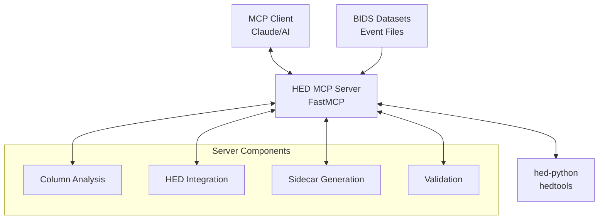

# HED MCP Server

> [!CAUTION]
> **Implementation Status**: This project is currently in active development. The implementation is coming soon!

A Model Context Protocol (MCP) server that assists with HED (Hierarchical Event Descriptors, https://hedtags.org) sidecar creation and annotation. The server leverages LLMs to automate the typically manual process of categorizing BIDS (Brain Imaging Data Structure, https://bids.neuroimaging.io) event file columns and generate valid HED sidecar templates using hed-python tools.

## Key Features

- **AI-Powered Column Classification**: Automatically categorize BIDS event file columns using LLM intelligence
- **Automated Sidecar Generation**: Generate valid HED sidecar templates using TabularSummary from hed-python
- **MCP Integration**: Seamless integration with AI applications through the Model Context Protocol
- **Performance Optimized**: <2 seconds for analysis, <10 seconds for sidecar generation
- **Scientific Standards**: Full compliance with BIDS and HED specifications

## Quick Start

### Installation

#### Option 1: Using uv (Recommended)
```bash
# Install uv if not already installed
curl -LsSf https://astral.sh/uv/install.sh | sh

# Clone and set up
git clone https://github.com/neuromechanist/hed-mcp.git
cd hed-mcp
uv sync --dev
```

#### Option 2: From PyPI (When Available)
```bash
pip install hed-mcp
# Or: uv add hed-mcp
```

### Running the Server

```bash
# Method 1: Console script (recommended)
hed-mcp-server

# Method 2: With uv
uv run hed-mcp-server

# Method 3: Python module
python -m hed_tools.server
```

## MCP Client Configuration

### Recommended Configuration (Most Reliable)
Add to your MCP client configuration file:

```json
{
  "mcpServers": {
    "hed-mcp": {
      "command": "uv",
      "args": ["run", "--directory", "/path/to/hed-mcp", "python", "-m", "hed_tools.server"],
      "cwd": "/path/to/hed-mcp"
    }
  }
}
```

**Replace `/path/to/hed-mcp` with your actual project path.**

### Alternative Configurations

#### Global Installation
```json
{
  "mcpServers": {
    "hed-mcp": {
      "command": "hed-mcp-server"
    }
  }
}
```

#### Using uvx
```json
{
  "mcpServers": {
    "hed-mcp": {
      "command": "uvx",
      "args": ["--from", "hed-mcp", "hed-mcp-server"]
    }
  }
}
```

### Configuration File Locations

| **Client** | **Configuration File** |
|------------|------------------------|
| **Claude Desktop (macOS)** | `~/Library/Application Support/Claude/claude_desktop_config.json` |
| **Claude Desktop (Windows)** | `%APPDATA%\Claude\claude_desktop_config.json` |
| **Cursor** | `.cursor/mcp.json` in your workspace |
| **Windsurf** | `~/.codeium/windsurf/mcp_config.json` |

## Architecture Overview



**Core Components:**
- **Column Analysis Engine**: Extracts and analyzes BIDS event file columns for LLM classification
- **HED Integration Wrapper**: Interfaces with hedtools TabularSummary and schema validation
- **Sidecar Generation Pipeline**: Orchestrates column classification → sidecar generation workflow
- **MCP Server Framework**: FastMCP-based server with stdio transport

## Available Tools

### MCP Tools
- `analyze_event_columns`: Extract column information and unique values from BIDS event files
- `generate_hed_sidecar`: Generate HED sidecar templates using TabularSummary
- `validate_hed_string`: Validate HED strings against schema
- `validate_hed_file`: Validate HED-annotated files
- `list_hed_schemas`: List available HED schemas and versions

### Example Workflow
```
User: "I have a BIDS event file. Can you help me create a HED sidecar?"

Claude: I'll analyze your event file and generate a HED sidecar template.

[Uses analyze_event_columns tool]
Based on the analysis:
- onset, duration: timing columns (will skip)
- trial_type: categorical with ["go", "stop"] (good for HED)
- response: categorical with ["left", "right"] (good for HED)

[Uses generate_hed_sidecar tool]
Here's your validated HED sidecar template...
```

## Development Setup

### Prerequisites
- Python 3.10+
- [uv](https://docs.astral.sh/uv/) for dependency management

### Setup Commands
```bash
# Clone repository
git clone https://github.com/neuromechanist/hed-mcp.git
cd hed-mcp

# Development environment
uv sync --dev
source .venv/bin/activate  # Or use: uv run <command>

# Common commands
uv run pytest                    # Run tests
uv run pytest --cov=src        # Run with coverage
uv run ruff check src/ tests/   # Linting
uv run black src/ tests/        # Formatting
uv run mypy src/                # Type checking
```

### Project Structure
```
hed-mcp/
├── src/hed_tools/              # Main package
│   ├── server/                 # MCP server components
│   ├── tools/                  # Analysis tools & MCP tools
│   ├── hed_integration/        # HED-specific functionality
│   └── utils/                  # General utilities
├── tests/                      # Test suite (pytest)
├── examples/                   # User examples and sanity checks
├── docs/                       # Documentation
└── pyproject.toml             # Project configuration
```

## Technical Specifications

### Dependencies
- **hedtools** ≥0.5.0 - Official HED Python tools
- **mcp** ≥1.9.0 - Model Context Protocol framework
- **pandas** ≥2.0.0 - Data manipulation
- **numpy** ≥1.24.0 - Numerical operations

### Performance Requirements
- Column analysis: < 2 seconds response time
- Sidecar generation: < 10 seconds response time
- Concurrent request handling with robust error management
- Memory-efficient processing for large datasets

### Compatibility
- Python 3.10+
- Latest hedtools and MCP versions
- Cross-platform support (Windows, macOS, Linux)

## Troubleshooting

### Common Issues

**Server not found:**
- Check if the command path is correct in your MCP configuration
- Ensure uv is installed and accessible
- Use absolute paths instead of relative ones

**Module not found:**
- Run `uv sync` to install dependencies
- Verify the project directory path is correct
- Make sure you're using the recommended configuration method

**Permission errors:**
- Ensure the MCP client has read access to the project directory
- Check that the Python environment has necessary permissions

**Environment issues:**
- Use the `uv run --directory` approach for most reliable environment management
- Restart your MCP client after configuration changes
- Check MCP client logs for detailed error information

## Contributing

We welcome contributions! This project follows modern Python development practices:

### Development Standards
- **Code Style**: Black + isort formatting
- **Testing**: pytest with comprehensive coverage
- **Type Checking**: mypy for static type analysis
- **Linting**: ruff for fast Python linting

### Workflow
1. Fork the repository
2. Create a feature branch: `git checkout -b feature-name`
3. Set up environment: `uv sync --dev`
4. Make changes and run tests: `uv run pytest`
5. Format code: `uv run black . && uv run isort .`
6. Submit a pull request

## Repository Structure

- **`src/`** - Main source code for the HED MCP server
- **`tests/`** - Automated unit and integration tests
- **`examples/`** - User-facing examples and documentation
  - **`examples/sanity_checks/`** - Manual verification scripts
- **`scripts/`** - User utility scripts
- **`.scripts/`** - Development files (excluded from git)
- **`docs/`** - Documentation and guides

## License

This project is licensed under the BSD-3-Clause License - see the [LICENSE](LICENSE) file for details.

## Links

- **Homepage**: https://github.com/neuromechanist/hed-mcp
- **Issues**: https://github.com/neuromechanist/hed-mcp/issues
- **HED Tools**: https://github.com/hed-standard/hed-python
- **HED Specification**: https://hed-specification.readthedocs.io
- **BIDS Specification**: https://bids-specification.readthedocs.io/en/stable/
