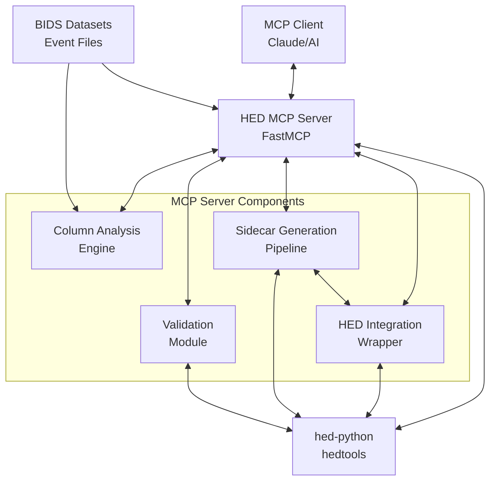

# HED MCP Server

> **Implementation Status**: This project is currently in active development. The implementation is coming soon!

A Model Context Protocol (MCP) server that assists with HED (Hierarchical Event Descriptors) sidecar creation and annotation. The server leverages LLMs to automate the typically manual process of categorizing BIDS event file columns and generate valid HED sidecar templates using hed-python tools.

## Overview

The HED MCP Server bridges the gap between BIDS (Brain Imaging Data Structure) datasets and HED annotation by providing AI-powered column classification and automated sidecar generation. This tool is designed to streamline the workflow for researchers working with neuroimaging data who need to create HED-compliant annotations.

### Key Features

- **AI-Powered Column Classification**: Automatically categorize BIDS event file columns using LLM intelligence
- **Automated Sidecar Generation**: Generate valid HED sidecar templates using TabularSummary from hed-python
- **MCP Integration**: Seamless integration with AI applications through the Model Context Protocol
- **Performance Optimized**: <2 seconds for analysis, <10 seconds for sidecar generation
- **Scientific Standards**: Full compliance with BIDS and HED specifications
- **Multiple Integration Options**: Support for both direct API and web service approaches

## Architecture



### Core Components

1. **Column Analysis Engine**: Extracts and analyzes BIDS event file columns for LLM classification
2. **HED Integration Wrapper**: Interfaces with hedtools TabularSummary and schema validation
3. **Sidecar Generation Pipeline**: Orchestrates column classification → sidecar generation workflow
4. **MCP Server Framework**: FastMCP-based server with stdio transport
5. **Validation Module**: Ensures generated sidecars meet HED standards

## Planned Features

### MCP Tools
- `analyze_event_columns`: Extract column information and unique values from BIDS event files
- `generate_hed_sidecar`: Generate HED sidecar templates using TabularSummary

### MCP Resources
- `hed_schemas`: List available HED schemas and versions (up to 8.2.0)

### Workflow Integration
Based on the proven `extract_json_template.ipynb` workflow:
1. Load BIDS event files
2. Classify columns (skip vs value columns)
3. Use TabularSummary to generate sidecar templates
4. Validate generated HED annotations

## Technical Specifications

### Dependencies
- **hedtools** ≥0.5.0 - Official HED Python tools
- **mcp** ≥1.0.0 - Model Context Protocol framework
- **pandas** ≥2.0.0 - Data manipulation
- **numpy** ≥1.24.0 - Numerical operations

### Performance Requirements
- Column analysis: < 2 seconds response time
- Sidecar generation: < 10 seconds response time
- Concurrent request handling with robust error management
- Memory-efficient processing for large datasets

### Compatibility
- Python 3.10+
- Latest hedtools and MCP versions
- Cross-platform support (Windows, macOS, Linux)
- No local path dependencies - fully distributable

## Development Resources

This project builds upon established patterns and references:

- **HED-Python Repository**: Integration with official hedtools package
- **MCP Python SDK**: FastMCP server implementation patterns
- **Reference Workflow**: Based on `extract_json_template.ipynb` from hed-examples

## Installation (Coming Soon)

### Using uv (Recommended)

First, install uv if you haven't already:

```bash
# On macOS and Linux
curl -LsSf https://astral.sh/uv/install.sh | sh

# On Windows
powershell -c "irm https://astral.sh/uv/install.ps1 | iex"

# Or via pip
pip install uv
```

Then install the HED MCP server:

```bash
# Install from PyPI (when available)
uv add hed-mcp-server

# Or install in a new environment
uv venv hed-mcp-env
uv pip install hed-mcp-server
```

### Using pip

```bash
# Alternative installation method
pip install hed-mcp-server
```

### Development Setup (Coming Soon)

```bash
# Clone the repository
git clone https://github.com/your-org/hed-mcp.git
cd hed-mcp

# Set up development environment with uv
uv sync

# Run the server
uv run python -m hed_mcp.server
```

## Usage Examples (Coming Soon)

### With Claude Desktop

```json
{
  "mcpServers": {
    "hed-mcp": {
      "command": "uv",
      "args": ["run", "python", "-m", "hed_mcp.server"],
      "cwd": "/path/to/hed-mcp"
    }
  }
}
```

### Example Workflow

```
User: "I have a BIDS event file. Can you help me create a HED sidecar?"

Claude: I'll analyze your event file and generate a HED sidecar template.

[Uses analyze_event_columns tool]
Based on the analysis:
- onset, duration: timing columns (will skip)  
- trial_type: categorical with ["go", "stop"] (good for HED)
- response: categorical with ["left", "right"] (good for HED)

[Uses generate_hed_sidecar tool]
Here's your validated HED sidecar template...
```

## Contributing

We welcome contributions! This project follows modern Python development practices:

- **Code Style**: Black + isort formatting
- **Testing**: pytest with comprehensive coverage
- **Documentation**: mkdocs with Material theme
- **Packaging**: uv for dependency management
- **CI/CD**: GitHub Actions for automated testing and deployment

## License

This project is licensed under the BSD 3-Clause License - see the [LICENSE](LICENSE) file for details.

## Acknowledgments

- **HED Community**: For developing and maintaining the HED standard and tools
- **BIDS Community**: For establishing neuroimaging data structure standards
- **MCP Framework**: For providing a robust protocol for AI integration

## Contact

For questions about this project or HED integration, please:
- Open an issue on GitHub
- Refer to the HED documentation at [hed-specification.org](https://hed-specification.org)
- Consult the BIDS specification at [bids-specification.org](https://bids-specification.org)

---

*This project aims to make HED annotation more accessible to the neuroimaging research community through AI-powered automation while maintaining scientific rigor and standards compliance.* 