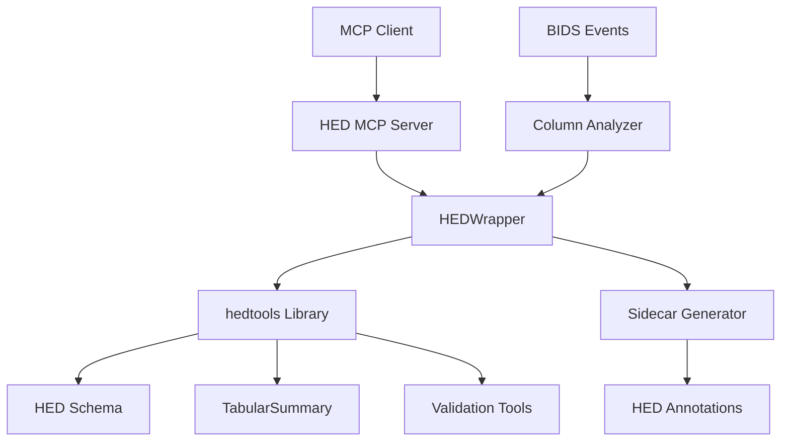

# HED Integration Guide

This guide explains how the HED MCP Server integrates with HED (Hierarchical Event Descriptor) tools and standards, providing detailed information about HED concepts, integration patterns, and best practices.

## Table of Contents

- [HED Overview](#hed-overview)
- [Integration Architecture](#integration-architecture)
- [HED Schema Management](#hed-schema-management)
- [TabularSummary Integration](#tabularsummary-integration)
- [Validation and Compliance](#validation-and-compliance)
- [Sidecar Generation Workflow](#sidecar-generation-workflow)
- [Best Practices](#best-practices)
- [Advanced Features](#advanced-features)
- [Troubleshooting](#troubleshooting)

## HED Overview

### What is HED?

HED (Hierarchical Event Descriptor) is a structured vocabulary for describing events in behavioral and neuroimaging experiments. It provides:

- **Standardized terminology** for experimental events
- **Hierarchical organization** of descriptive tags
- **Extensibility** through custom schema libraries
- **Machine-readable annotations** for data analysis

### HED in BIDS Context

In BIDS (Brain Imaging Data Structure) datasets, HED annotations are typically stored in:

- **Sidecar JSON files** (e.g., `task-faces_events.json`)
- **Events TSV files** (direct HED column annotations)
- **Dataset descriptors** (schema version specifications)

### Key HED Concepts

#### 1. HED Tags
Hierarchical descriptors separated by forward slashes:
```
Event/Category/Experimental-stimulus
Sensory-event/Visual/Rendering-type/Screen
Agent-action/Move/Translate/Push
```

#### 2. HED Strings
Comma-separated collections of HED tags:
```
Event/Category/Experimental-stimulus, Sensory-event/Visual/Rendering-type/Screen, Red
```

#### 3. HED Schema
Structured vocabulary defining valid tags and their relationships:
- **Standard Schema**: Official HED vocabulary
- **Library Schemas**: Domain-specific extensions
- **Version Control**: Semantic versioning for schema evolution

## Integration Architecture

The HED MCP Server integrates with HED tools through multiple layers:



### Integration Components

#### 1. HEDWrapper Class
**Purpose**: Simplifies hedtools library usage
**Key Features**:
- Schema loading and management
- Event validation
- Sidecar template generation
- HED string parsing

#### 2. Schema Management
**Purpose**: Handle multiple HED schema versions
**Capabilities**:
- Automatic schema downloading
- Version-specific loading
- Custom schema support
- Schema validation

#### 3. TabularSummary Integration
**Purpose**: Generate HED sidecars from BIDS events
**Process**:
- Column classification (skip vs. value columns)
- Template generation based on unique values
- Schema-compliant annotation structure

## HED Schema Management

### Available Schema Versions

The integration supports HED schema versions 8.0.0 and higher:

```python
from hed_tools import create_hed_wrapper

wrapper = create_hed_wrapper()
schemas = wrapper.get_available_schemas()

for schema in schemas:
    print(f"Version {schema['version']}: {schema['description']}")
```

### Loading Schemas

#### Standard Schema Loading

```python
# Load latest schema
wrapper = create_hed_wrapper()
await wrapper.load_schema()

# Load specific version
await wrapper.load_schema(version="8.2.0")

# Check schema status
info = wrapper.get_schema_info()
print(f"Schema loaded: {info['loaded']}")
print(f"Version: {info['version']}")
```

#### Custom Schema Loading

```python
from pathlib import Path

# Load custom schema file
custom_path = Path("custom_schema.xml")
await wrapper.load_schema(custom_path=custom_path)

# Verify custom schema
info = wrapper.get_schema_info()
print(f"Custom schema path: {info['path']}")
```

### Schema Validation

```python
# Validate HED string against loaded schema
hed_string = "Event/Category/Experimental-stimulus, Red"
result = wrapper.parse_hed_string(hed_string)

if result['valid']:
    print(f"Valid HED string with {len(result['tags'])} tags")
else:
    print(f"Validation errors: {result['errors']}")
```

## TabularSummary Integration

### Overview

TabularSummary is a core hedtools component that generates HED sidecar templates from BIDS events data. Our integration simplifies this process while maintaining full functionality.

### Basic TabularSummary Workflow

```python
from hed_tools import create_hed_wrapper, create_file_handler
import pandas as pd

# Load events data
handler = create_file_handler()
events_df = await handler.load_events_file(Path("events.tsv"))

# Initialize HED wrapper
wrapper = create_hed_wrapper()
await wrapper.load_schema()

# Generate sidecar template
sidecar = await wrapper.generate_sidecar_template(events_df)

# Save sidecar
await handler.save_json_file(sidecar, Path("events.json"))
```

### Column Classification

The integration automatically classifies columns into categories:

#### Skip Columns
Columns that should not have HED annotations:
- `onset`: Event timing information
- `duration`: Event duration
- `trial_number`: Administrative data
- `response_time`: Continuous measurements

#### Value Columns
Columns suitable for HED annotation:
- `trial_type`: Experimental conditions
- `condition`: Stimulus conditions
- `response`: Subject responses
- `stimulus`: Stimulus identifiers

```python
from hed_tools import create_column_analyzer

analyzer = create_column_analyzer()
analysis = await analyzer.analyze_events_file(Path("events.tsv"))

# Review column classification
for col_name, col_info in analysis['columns'].items():
    if col_info['hed_suitable']:
        print(f"✅ {col_name}: {col_info['type']} ({col_info['unique_count']} unique values)")
    else:
        print(f"❌ {col_name}: {col_info['skip_reason']}")
```

### Customizing Sidecar Generation

#### Selective Column Processing

```python
# Process only specific columns
target_columns = ['trial_type', 'condition', 'response']
sidecar = await wrapper.generate_sidecar_template(
    events_df,
    columns_to_process=target_columns
)
```

#### Advanced Template Customization

```python
# Generate base template
sidecar = await wrapper.generate_sidecar_template(events_df)

# Customize with domain-specific information
sidecar['trial_type']['HED'] = {
    'face': 'Event/Category/Experimental-stimulus, Sensory-event/Visual/Face',
    'house': 'Event/Category/Experimental-stimulus, Sensory-event/Visual/House',
    'scrambled': 'Event/Category/Experimental-stimulus, Sensory-event/Visual/Scrambled-image'
}

sidecar['response']['HED'] = {
    'left': 'Agent-action/Move/Press, Participant-response/Manual/Left-hand',
    'right': 'Agent-action/Move/Press, Participant-response/Manual/Right-hand'
}

# Save customized sidecar
await handler.save_json_file(sidecar, Path("custom_events.json"))
```

## Validation and Compliance

### BIDS Compliance Validation

```python
from hed_tools import create_file_handler

handler = create_file_handler()

# Validate BIDS events structure
validation = await handler.validate_bids_events_structure(Path("events.tsv"))

print(f"BIDS Compliant: {validation['valid']}")

if validation['errors']:
    print("Errors:")
    for error in validation['errors']:
        print(f"  - {error}")

if validation['warnings']:
    print("Warnings:")
    for warning in validation['warnings']:
        print(f"  - {warning}")
```

### HED Annotation Validation

```python
# Load events and sidecar
events_df = await handler.load_events_file(Path("events.tsv"))
sidecar = await handler.load_json_file(Path("events.json"))

# Validate HED annotations
wrapper = create_hed_wrapper()
await wrapper.load_schema()

validation = await wrapper.validate_events(events_df, sidecar)

print(f"HED Valid: {validation['valid']}")
print(f"Errors: {len(validation['errors'])}")
print(f"Warnings: {len(validation['warnings'])}")

# Show validation statistics
stats = validation['statistics']
print(f"Total events: {stats['total_events']}")
print(f"HED tags found: {stats['hed_tags_found']}")
```

## Sidecar Generation Workflow

### Complete Workflow Example

This example demonstrates the full workflow from BIDS events analysis to HED sidecar generation:

```python
async def complete_hed_workflow(events_path: str):
    """Complete HED annotation workflow."""
    from hed_tools import create_integration_suite
    from pathlib import Path

    # Initialize components
    suite = create_integration_suite()
    analyzer = suite['column_analyzer']
    wrapper = suite['hed_wrapper']
    handler = suite['file_handler']

    events_path = Path(events_path)
    sidecar_path = events_path.with_suffix('.json')

    print("🔍 Step 1: Analyzing BIDS events file...")

    # Validate BIDS compliance
    bids_validation = await handler.validate_bids_events_structure(events_path)
    if not bids_validation['valid']:
        print("❌ BIDS validation failed:")
        for error in bids_validation['errors']:
            print(f"   {error}")
        return False

    # Analyze columns
    analysis = await analyzer.analyze_events_file(events_path)
    hed_candidates = analysis['hed_candidates']

    print(f"   Found {len(hed_candidates)} columns suitable for HED annotation")

    print("📂 Step 2: Loading events data...")
    events_df = await handler.load_events_file(events_path)

    print("📋 Step 3: Loading HED schema...")
    await wrapper.load_schema()

    print("🏗️  Step 4: Generating HED sidecar template...")

    # Extract column names for processing
    target_columns = [c['column'] for c in hed_candidates]

    # Generate sidecar
    sidecar = await wrapper.generate_sidecar_template(
        events_df,
        target_columns
    )

    print("✨ Step 5: Enhancing sidecar with intelligent suggestions...")

    # Add intelligent HED suggestions
    for candidate in hed_candidates:
        column_name = candidate['column']
        column_data = events_df[column_name]

        # Get HED suggestions
        suggestions = await analyzer.suggest_hed_annotations(
            column_data,
            column_name
        )

        # Add suggestions to sidecar
        if column_name in sidecar and 'HED' in sidecar[column_name]:
            for suggestion in suggestions:
                value = suggestion['value']
                hed_annotation = suggestion['suggested_hed']
                sidecar[column_name]['HED'][value] = hed_annotation

    print("💾 Step 6: Saving HED sidecar...")
    success = await handler.save_json_file(sidecar, sidecar_path)

    if success:
        print("✅ Step 7: Validating generated annotations...")

        # Validate the generated sidecar
        validation = await wrapper.validate_events(events_df, sidecar)

        print(f"   Validation: {'✅ Passed' if validation['valid'] else '❌ Failed'}")
        print(f"   Events processed: {validation['statistics']['total_events']}")
        print(f"   HED tags: {validation['statistics']['hed_tags_found']}")

        if validation['errors']:
            print("   Validation errors:")
            for error in validation['errors'][:5]:  # Show first 5 errors
                print(f"     - {error}")

        print(f"🎉 Complete! HED sidecar saved to: {sidecar_path}")
        return sidecar
    else:
        print("❌ Failed to save sidecar")
        return None

# Usage
sidecar = await complete_hed_workflow("sub-01_task-faces_events.tsv")
```

## Best Practices

### 1. Schema Version Management

**Recommendation**: Use specific schema versions for reproducibility:

```python
# ✅ Good: Specify exact version
wrapper = create_hed_wrapper(schema_version="8.2.0")

# ❌ Avoid: Using "latest" in production
wrapper = create_hed_wrapper(schema_version="latest")
```

**Version Selection Guidelines**:
- **Latest stable** for new projects
- **Specific versions** for published datasets
- **Custom schemas** for specialized domains

### 2. Column Classification Strategy

**High Priority Columns** (annotate first):
- `trial_type`: Experimental conditions
- `condition`: Stimulus or task conditions
- `stimulus`: Stimulus identifiers
- `response`: Subject responses

**Medium Priority Columns**:
- Categorical data with 2-20 unique values
- Experimental manipulation variables
- Behavioral measures

**Skip Columns**:
- Timing data (`onset`, `duration`, `response_time`)
- Administrative data (`trial_number`, `run_number`)
- Continuous measurements

### 3. Sidecar Quality Guidelines

**Structure Requirements**:
```json
{
  "column_name": {
    "Description": "Clear, informative description",
    "HED": {
      "value1": "Valid/HED/Tag/Structure",
      "value2": "Another/Valid/Structure"
    }
  }
}
```

**Tag Selection Principles**:
- Use **specific tags** over general ones
- Include **sensory modality** for stimuli
- Specify **action types** for responses
- Add **temporal information** when relevant

### 4. Validation Workflow

**Incremental Validation**:
```python
# Validate at each step
async def validated_workflow():
    # 1. Validate BIDS structure
    bids_validation = await handler.validate_bids_events_structure(events_path)
    assert bids_validation['valid'], "BIDS validation failed"

    # 2. Validate schema loading
    schema_loaded = await wrapper.load_schema()
    assert schema_loaded, "Schema loading failed"

    # 3. Validate generated sidecar
    validation = await wrapper.validate_events(events_df, sidecar)
    assert validation['valid'], f"HED validation failed: {validation['errors']}"
```

### 5. Performance Optimization

**Large Dataset Handling**:
```python
async def optimize_for_large_datasets(events_path: Path):
    # Sample large files for analysis
    df = await handler.load_events_file(events_path)

    if len(df) > 10000:
        # Use representative sample for column analysis
        sample_df = df.sample(n=5000, random_state=42)
        analysis = await analyzer.analyze_events_file(sample_df)

        # Apply results to full dataset
        target_columns = [c['column'] for c in analysis['hed_candidates']]
        sidecar = await wrapper.generate_sidecar_template(df, target_columns)
    else:
        # Process normally for smaller files
        analysis = await analyzer.analyze_events_file(df)
        sidecar = await wrapper.generate_sidecar_template(df)

    return sidecar
```

## Advanced Features

### 1. Custom HED Annotations

```python
# Create domain-specific annotations
custom_annotations = {
    'face_identity': {
        'person1': 'Agent/Person/Identity/Person-1, Sensory-event/Visual/Face',
        'person2': 'Agent/Person/Identity/Person-2, Sensory-event/Visual/Face'
    },
    'emotion': {
        'happy': 'Property/Informational-property/Categorical-value/Happy',
        'sad': 'Property/Informational-property/Categorical-value/Sad'
    }
}

# Apply to sidecar
for column, values in custom_annotations.items():
    if column in sidecar:
        sidecar[column]['HED'] = values
```

### 2. Multi-Schema Support

```python
# Support multiple schema versions
async def multi_schema_validation(events_df, sidecar):
    results = {}

    for version in ['8.0.0', '8.1.0', '8.2.0']:
        wrapper = create_hed_wrapper(schema_version=version)
        await wrapper.load_schema()

        validation = await wrapper.validate_events(events_df, sidecar)
        results[version] = validation['valid']

    return results
```

### 3. Automated HED Suggestion Enhancement

```python
# Enhanced suggestion system
class IntelligentHEDSuggester:
    def __init__(self):
        self.domain_mappings = {
            'faces': 'Sensory-event/Visual/Face',
            'houses': 'Sensory-event/Visual/House',
            'words': 'Sensory-event/Auditory/Word',
            'tones': 'Sensory-event/Auditory/Tone'
        }

    async def suggest_enhanced_hed(self, column_name: str, value: str) -> str:
        """Generate enhanced HED suggestions using domain knowledge."""
        base_suggestion = await self._get_base_suggestion(column_name, value)

        # Add domain-specific enhancements
        if 'stimulus' in column_name.lower():
            base_suggestion += f", {self._get_stimulus_category(value)}"

        if 'response' in column_name.lower():
            base_suggestion += f", Agent-action/Press"

        return base_suggestion
```

## Troubleshooting

### Common Integration Issues

#### 1. Schema Loading Failures

**Symptoms**:
- `schema_loaded = False`
- Empty schema info

**Solutions**:
```python
# Check hedtools installation
try:
    import hed
    print(f"hedtools version: {hed.__version__}")
except ImportError:
    print("hedtools not installed - run: pip install hedtools>=0.5.0")

# Verify schema availability
schemas = wrapper.get_available_schemas()
if not schemas:
    print("No schemas available - check hedtools installation")
```

#### 2. TabularSummary Integration Issues

**Symptoms**:
- Empty sidecar generation
- Missing HED templates

**Solutions**:
```python
# Debug TabularSummary integration
try:
    from hed.tools.analysis.tabular_summary import TabularSummary
    print("TabularSummary available")
except ImportError:
    print("TabularSummary not available - update hedtools")

# Check column classification
analysis = await analyzer.analyze_events_file(events_path)
if not analysis['hed_candidates']:
    print("No HED candidates found - check column content")
```

#### 3. Validation Errors

**Common validation issues**:
- Invalid HED tag structure
- Missing required schema elements
- Incorrect value mappings

**Debugging approach**:
```python
# Detailed validation debugging
validation = await wrapper.validate_events(events_df, sidecar)

if not validation['valid']:
    print("Validation errors:")
    for i, error in enumerate(validation['errors'][:10]):
        print(f"{i+1}. {error}")

    # Check specific HED strings
    for column in sidecar:
        if 'HED' in sidecar[column]:
            for value, hed_string in sidecar[column]['HED'].items():
                result = wrapper.parse_hed_string(hed_string)
                if not result['valid']:
                    print(f"Invalid HED in {column}[{value}]: {result['errors']}")
```

### Performance Issues

#### Large File Processing

```python
# Monitor performance
import time

async def timed_processing(events_path: Path):
    start_time = time.time()

    # Column analysis timing
    analysis_start = time.time()
    analysis = await analyzer.analyze_events_file(events_path)
    analysis_time = time.time() - analysis_start

    # Sidecar generation timing
    sidecar_start = time.time()
    sidecar = await wrapper.generate_sidecar_template(events_df)
    sidecar_time = time.time() - sidecar_start

    total_time = time.time() - start_time

    print(f"Performance Report:")
    print(f"  Column analysis: {analysis_time:.2f}s")
    print(f"  Sidecar generation: {sidecar_time:.2f}s")
    print(f"  Total time: {total_time:.2f}s")

    return sidecar
```

### Getting Help

For HED integration issues:

1. **Check hedtools documentation**: [HED Python Tools](https://hed-python.readthedocs.io/)
2. **Review HED specification**: [HED Schema Specification](https://hed-specification.org/)
3. **Consult BIDS standard**: [BIDS Specification](https://bids-specification.org/)
4. **Open issues**: [GitHub Issues](https://github.com/hed-standard/hed-mcp/issues)

### Additional Resources

- **HED Online Tools**: [HED Online](https://hedtools.org/)
- **BIDS Validator**: [BIDS Validator](https://bids-standard.github.io/bids-validator/)
- **HED Examples**: [HED Examples Repository](https://github.com/hed-standard/hed-examples)
- **hedtools Documentation**: [hedtools API](https://hed-python.readthedocs.io/)
